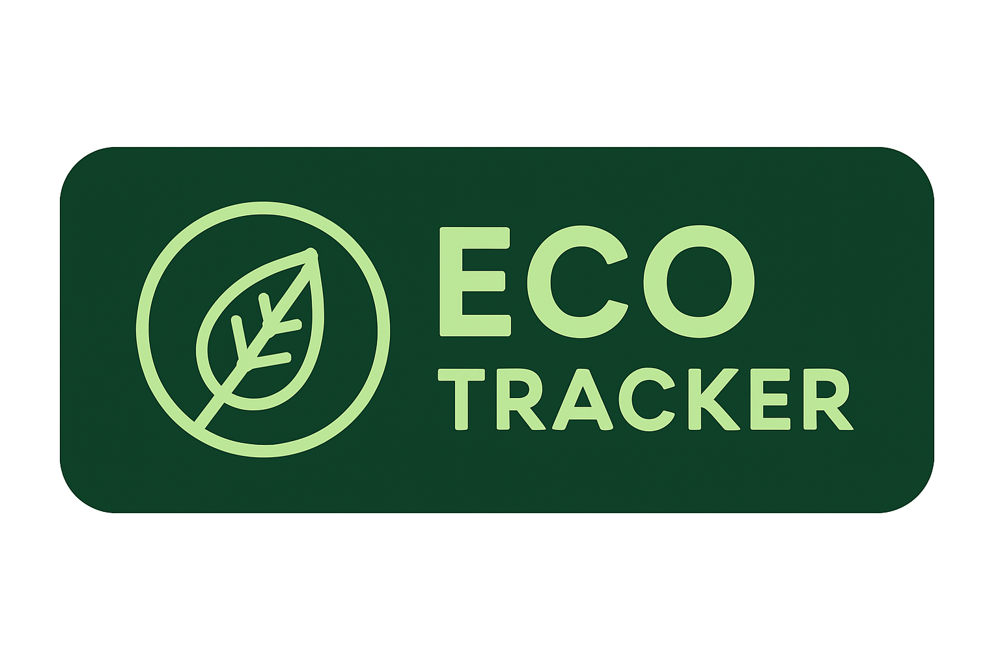

<h1 align="center">Hi 👋, I'm Abiram R</h1>
<h3 align="center">AI & Data Science Student | Developer | Innovator 🚀</h3>

---

## 🌟 About Me
- 🎓 I’m an **AI & Data Science Student**
- 💻 Interested in **Machine Learning, Deep Learning & Web Development**
- 🌱 Currently learning **Node.js, Express & MongoDB**
- 🤝 Looking for **collaborations on AI + Sustainability projects**
- 📫 Reach me at: **abiram.r1010@gmail.com**

---

## 🏢 My Project

  

🌱 A sustainability project to track and reduce carbon footprint 💚

---

## 🚀 Skills & Tools

  <!-- Languages -->
  
  
  
  

  <!-- Web -->
  
  
  
  
  
  

  <!-- Tools -->
  
  
  

---

## 📊 GitHub Stats

  
  

---

## 🌐 Connect With Me

  
  
  

---

✨ _“Code. Learn. Innovate. Repeat.”_

<!--
**Abiram070207/Abiram070207** is a ✨ _special_ ✨
Here are some ideas to get you started:

- 🔭 I’m currently working on ...
- 🌱 I’m currently learning ...
- 👯 I’m looking to collaborate on ...
- 🤔 I’m looking for help with ...
- 💬 Ask me about ...
- 📫 How to reach me: ...
- 😄 Pronouns: ...
- ⚡ Fun fact: ...
-->
